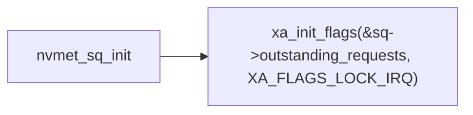
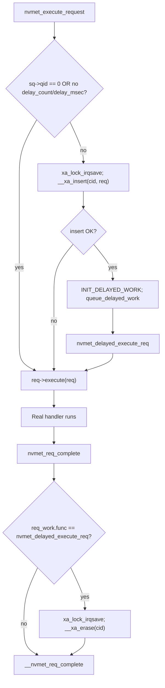
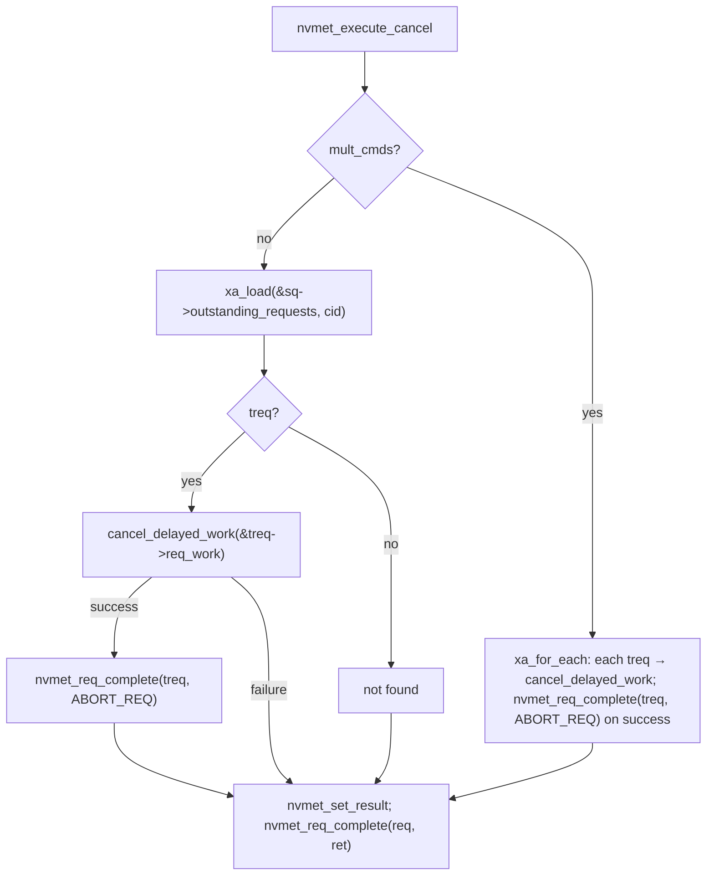

# `nvme-cancel-lsfmm_2`: branch summary and `xa_load` vs `xa_for_each`

This document describes changes on the Git branch **`nvme-cancel-lsfmm_2`** (relative to **`johnm/nvme-7.1`**) and explains how **`xa_load`** and **`xa_for_each`** are used in the nvmet cancel / delayed-request path—including what counts as an optimization.

---

## What `nvme-cancel-lsfmm_2` changes (vs `johnm/nvme-7.1`)

The branch is a **linear stack**: it includes the host-side timeout/cancel series (sysfs timeouts, `nvme_submit_cancel_req` / abort in core, TCP/RDMA, etc.) and adds **target (nvmet)** work on top.

### nvmet-only commits (illustrative)

| Commit (short) | Role |
|----------------|------|
| `aed6bad` | Stub/emulation for cancel on the target |
| `3a9b4dd` | Route all `req->execute` through **`nvmet_execute_request()`** |
| `24173479` | Debugfs **`delay`** on `nvmet_ctrl` |
| `9b5222a` | **Delayed** execution of I/O commands (debug) |
| `a3fa2add` | **Command tracking** (`struct xarray outstanding_requests` per SQ) |
| `eac20da8` | **`nvmet_execute_cancel()`** in `io-cmd-cancel.c` |

### Behavior (nvmet)

1. **`CONFIG_NVME_TARGET_DELAY_REQUESTS`**: optional **delay** before running the real handler (`nvmet_delayed_execute_req` → `req->execute(req)`), with **`delay_count`** / **`delay_msec`** from debugfs.
2. While delaying, the request is stored in **`sq->outstanding_requests`** (xarray), keyed by **`req->cmd->common.command_id`**, with **`xa_init_flags(..., XA_FLAGS_LOCK_IRQ)`** when the SQ is set up (`drivers/nvme/target/core.c`).
3. **Insert** under **`xa_lock_irqsave`** (`__xa_insert`); **erase** on **`nvmet_req_complete()`** only if completion follows the delayed-work path (`req_work.func == nvmet_delayed_execute_req`).
4. **Cancel** (`nvmet_execute_cancel` in `drivers/nvme/target/io-cmd-cancel.c`): looks up those entries to **`cancel_delayed_work`** and **`nvmet_req_complete(..., ABORT_REQ)`**.

Transports call **`nvmet_execute_request()`** instead of calling **`req->execute()`** directly.

---

## `xa_load` vs `xa_for_each` — design and “optimization”

In `io-cmd-cancel.c` the code **branches on NVMe cancel semantics** (single vs multiple commands), not on a micro-optimization in isolation.

### Single-command cancel (`!mult_cmds`)

```c
treq = xa_load(&sq->outstanding_requests, cid);
```

- **`xa_load(xa, cid)`** is a **direct lookup by index** (the command ID being canceled).
- **Why this is appropriate:** only **one** pointer is needed. Cost is **O(1)** for that lookup; the implementation does **not** walk the entire xarray.
- Using **`xa_for_each`** here would **scan every stored outstanding request** even though the protocol already provides **`cid`**—extra work for the common single-target case.

### Multi-command cancel (`mult_cmds`)

```c
xa_for_each(&sq->outstanding_requests, ucid, treq) {
    if (cancel_delayed_work(&treq->req_work)) {
        nvmet_req_complete(treq, NVME_SC_ABORT_REQ);
        canceled += 1;
    }
}
```

- **`xa_for_each`** **iterates only indices that exist** in the sparse xarray.
- **Why this is appropriate:** “cancel multiple / all outstanding” requires visiting **every** tracked request on that SQ. There is **no single `cid`** for **`xa_load`** in this mode (per the command validation in the same function).
- A naive loop over **`cid` from 0 to 65535** with **`xa_load`** each time would **probe many empty indices**. **`xa_for_each`** avoids that by walking stored entries.

### Summary table

| API | Use case in this branch | Rationale |
|-----|-------------------------|-----------|
| **`xa_load`** | One known **`cid`** | Indexed fetch; no full scan |
| **`xa_for_each`** | All outstanding on this SQ | Full enumeration without scanning the whole ID space |

Together with **`__xa_insert` / `__xa_erase`** under **`xa_lock_irqsave`**, the xarray provides **sparse storage by command ID** plus **efficient single lookup** vs **efficient full enumeration**, depending on cancel mode.

---

## Locking note

**`xa_load`** in **`nvmet_execute_cancel`** runs **without** holding the xarray lock; inserts/erases use **`xa_lock_irqsave`**. That matches the usual kernel pattern: **locked writers**, **lockless readers** (`xa_load`) coordinated with those updates.

---

## Call graphs

The diagrams below mirror the functions in **`drivers/nvme/target/core.c`** and **`drivers/nvme/target/io-cmd-cancel.c`**. Transport entry points differ (TCP, RDMA, FC, loop, etc.) but converge on **`nvmet_execute_request()`** after **`nvmet_req_init()`** succeeds.

### SQ setup and xarray lifetime



### Overview: request enters the target

Transports differ, but after **`nvmet_req_init()`** succeeds they call **`nvmet_execute_request()`** (see e.g. **`nvmet_tcp_execute_request()`** in **`tcp.c`**).


### Delayed I/O: `__xa_insert` → work → `__xa_erase`

This is the path guarded by **`CONFIG_NVME_TARGET_DELAY_REQUESTS`** in **`nvmet_execute_request()`** / **`nvmet_req_complete()`**.



**Parse-time note:** **`nvmet_parse_io_cmd()`** sets **`req->execute = nvmet_execute_cancel`** for **`nvme_cmd_cancel`** when **`CONFIG_NVME_TARGET_DELAY_REQUESTS`** is enabled; that handler is still invoked via **`nvmet_execute_request()`** → **`req->execute()`** (with the same delay gate as other I/O on that queue).

### `nvmet_execute_cancel()`: single `cid` vs multi-command



---

## Reference paths

- `drivers/nvme/target/io-cmd-cancel.c` — `nvmet_execute_cancel()`
- `drivers/nvme/target/core.c` — `nvmet_execute_request()`, `nvmet_req_complete()`, `xa_init_flags` for `outstanding_requests`
- `drivers/nvme/target/nvmet.h` — `struct nvmet_sq` / `outstanding_requests`

Base comparison: `git log --oneline johnm/nvme-7.1..nvme-cancel-lsfmm_2`
