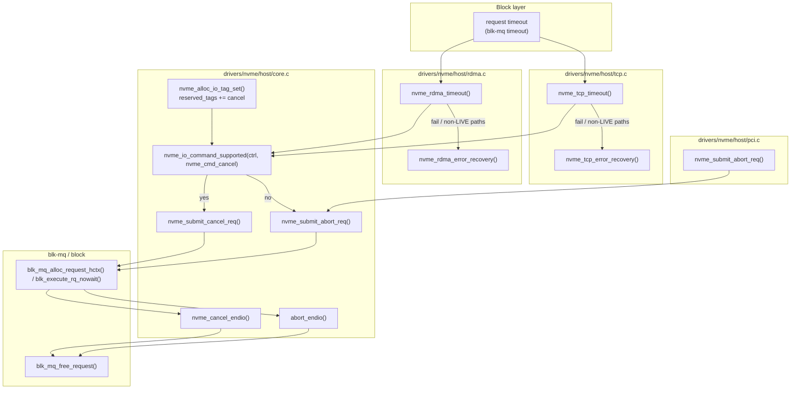
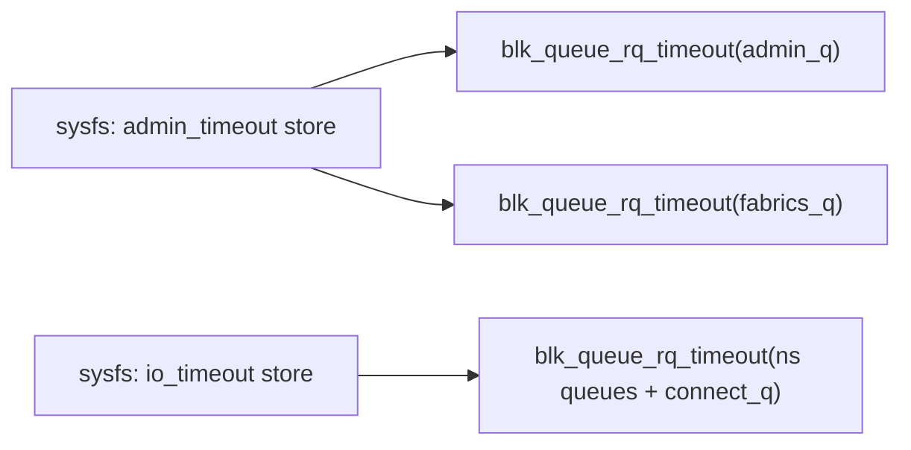
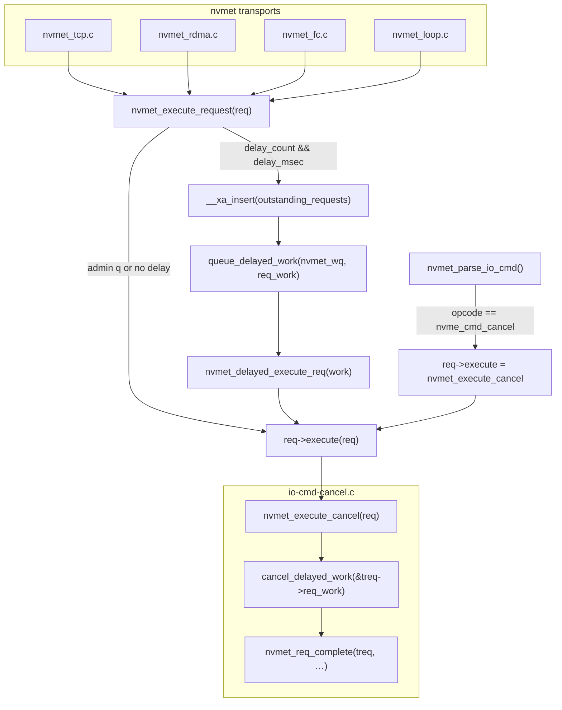
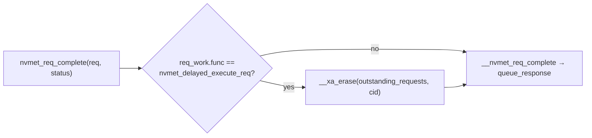
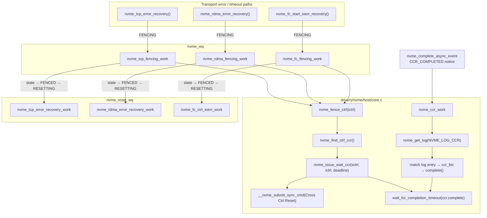
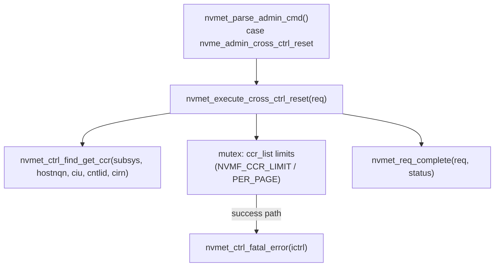

# NVMe branch analysis (vs `johnm/nvme-7.1`)

This document summarizes what each branch adds on top of remote ref **`johnm/nvme-7.1`** (`b85badf09823`) and provides **call graphs (Mermaid)** for the new or materially changed control paths. Branch tips were taken from the local repository at analysis time.

| Branch | Tip commit (short) | Scope vs base |
|--------|-------------------|---------------|
| `johnm_nvme_timeouts_7.1_v5` | `138c5e5e164e` | Host-side timeouts, cancel/abort plumbing, sysfs |
| `nvme-cancel-lsfmm_2` | `eac20da87fbe` | Above + **nvmet** cancel emulation, delayed I/O, tracking |
| `tp8028` | `e7df54f94fd6` | Above + **Cross-Controller Reset (CCR)**, fencing states, fabrics recovery |

---

## 1. `johnm_nvme_timeouts_7.1_v5`

### What was implemented

- **NVMe Cancel command definitions** in `include/linux/nvme.h` (opcode, action bits, command structure size check).
- **Core host support**: `nvme_io_command_supported()`, `nvme_is_cancel()`, **`nvme_submit_cancel_req()`** (async cancel with `nvme_cancel_endio`), **`nvme_submit_abort_req()`** (admin abort moved to core with `abort_endio`). Cancel uses reserved I/O tags on fabrics (`NVME_RSV_CANCEL_MAX` when cancel is supported).
- **Per-controller timeouts**: `nvme_wait_freeze_timeout()` waits using `ctrl->admin_timeout` / freeze semantics instead of a single global default where applicable. **`admin_timeout`** and **`io_timeout`** sysfs attributes update `blk_queue_rq_timeout()` on admin, fabrics, connect, and namespace queues.
- **PCI**: admin-path timeouts use the controller’s admin timeout; abort submission goes through `nvme_submit_abort_req()`.
- **NVMe-oF TCP/RDMA**: I/O timeout handlers prefer **Cancel** when the controller reports support, otherwise **Abort**; reserved-tag flags serialize single vs multi-command cancel on a queue.
- **Teardown alignment**: `nvme_free_ctrl()` tears down `fabrics_q` consistently with admin queue; **nvmet-loop** avoids allocating the admin tag set during reset; warning when admin tag set is allocated while a queue already exists.

### Call graph (host: I/O timeout → cancel/abort → recovery)

Edges follow the typical **LIVE** controller path (fabrics). PCI uses the abort path on the admin queue without the cancel branch.

`nvme_wait_freeze_timeout()` is invoked from freeze-sensitive paths in **TCP, RDMA, PCI, and Apple** host drivers (not shown as extra nodes above).

**PCI admin timeout** paths call `nvme_submit_abort_req()` directly (not shown as a separate timeout box above); fabrics I/O paths use the `nvme_tcp_timeout` / `nvme_rdma_timeout` decision tree.

### Call graph (sysfs → queue timeouts)

---

## 2. `nvme-cancel-lsfmm_2`

### What was implemented (in addition to everything in §1)

- **Target cancel command file** `drivers/nvme/target/io-cmd-cancel.c` with **`nvmet_execute_cancel()`**: validates cancel fields, walks **`sq->outstanding_requests`**, uses **`cancel_delayed_work(&treq->req_work)`** to pull delayed commands, completes them with abort status, returns a result count.
- **I/O parse path**: under `CONFIG_NVME_TARGET_DELAY_REQUESTS`, **`nvmet_parse_io_cmd()`** recognizes **`nvme_cmd_cancel`** early, sets **`req->execute = nvmet_execute_cancel`**, and accepts **`NVME_NSID_ALL`** without namespace resolution (demo / LSFMM style path).
- **Delayed execution wrapper**: **`nvmet_execute_request()`** (when delay debug is enabled) decrements **`ctrl->delay_count`**, and if nonzero schedules **`nvmet_delayed_execute_req`** via **`queue_delayed_work(nvmet_wq, …)`** after inserting the request in **`outstanding_requests`**. **`nvmet_req_complete()`** erases the xarray entry when completion follows the delayed path.
- **Transport entry**: **TCP/RDMA/FC/loop** call **`nvmet_execute_request()`** instead of calling **`req->execute(req)`** directly (central hook).
- **Debugfs**: per-controller **`delay`** file sets **`delay_msec`** and **`delay_count`** (`nvmet_ctrl_delay_*` in `debugfs.c`).
- **Build**: `Kconfig` / `Makefile` wire **`CONFIG_NVME_TARGET_DELAY_REQUESTS`** and **`io-cmd-cancel.o`**.

### Call graph (target: receive I/O → optional delay → handler)

### Call graph (complete path clears tracking)

---

## 3. `tp8028`

### What was implemented (in addition to everything in §2)

- **Rapid Path Failure Recovery / CCR (host)**:
  - New admin opcode path: **`nvme_fence_ctrl()`** loops with **`nvme_find_ctrl_ccr()`** → **`nvme_issue_wait_ccr()`** (builds **`nvme_ccr_entry`**, submits **`nvme_admin_cross_ctrl_reset`**, waits on **`ccr.complete`** or immediate success bit).
  - **Async completion**: **`nvme_ccr_work`** reads **`NVME_LOG_CCR`**, matches log entries to pending **`ccr_list`** entries, sets **`ccr->ccrs`**, **`complete()`**.
  - **AEN**: **`NVME_AER_NOTICE_CCR_COMPLETED`** queues **`ccr_work`**.
  - **Controller states**: **`NVME_CTRL_FENCING`** and **`NVME_CTRL_FENCED`** integrated into **`nvme_change_ctrl_state()`** transitions toward **`NVME_CTRL_RESETTING` / reconnect**.
- **CCR (target)**: **`nvmet_execute_cross_ctrl_reset()`** validates, **`nvmet_ctrl_find_get_ccr()`**, tracks **`ccr_list`**, enforces **`NVMF_CCR_LIMIT`** / log capacity, may call **`nvmet_ctrl_fatal_error(ictrl)`** on success path; **Identify** sets **CIU/CIRN** fields; **Get Log Page** implements **CCR log**; **AEN** on CCR completion.
- **Fabrics host recovery (TCP/RDMA/FC)**:
  - **`nvme_*_fencing_work`** calls **`nvme_fence_ctrl()`**, moves to **FENCED**, then may queue **`error_recovery` / `ioerr` work** on **`nvme_reset_wq`**.
  - **`nvme_*_error_recovery*`** **`flush_work(fencing_work)`** before teardown/reconnect.
  - **FC-specific**: **`nvme_fc_start_ioerr_recovery()`**, refined **I/O error recovery**, **hold inflight during FENCING**, avoid cancel before I/O tagset init.

### Call graph (host: error → fencing → CCR → reset work)

### Call graph (target: admin Cross Controller Reset)

---

## How these branches relate

Linear stack on this remote:

`johnm/nvme-7.1` → **`johnm_nvme_timeouts_7.1_v5`** → **`nvme-cancel-lsfmm_2`** → **`tp8028`**

So each later branch **contains** the earlier branch’s commits; the sections above describe **incremental** work on top of the prior tip.

---

## Notes on methodology

- **Call graphs** emphasize **new or rewired functions** visible in `git diff johnm/nvme-7.1..<branch>`, not every static helper or legacy path.
- For exact line-level behavior, inspect the branch tip with `git show <branch>:path` or `git diff johnm/nvme-7.1..<branch> -- path`.
